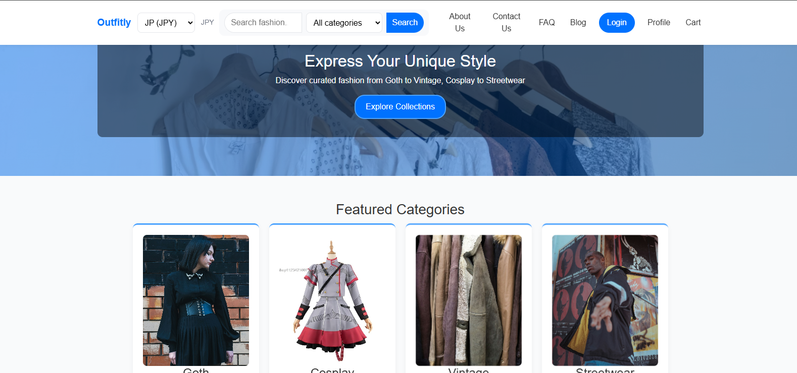
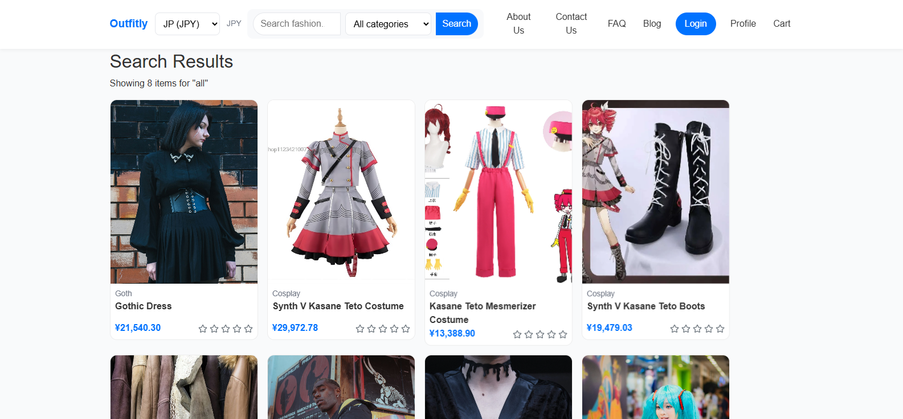
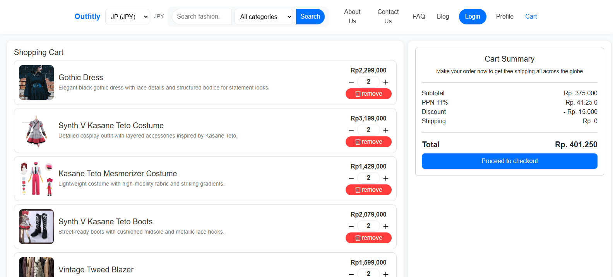
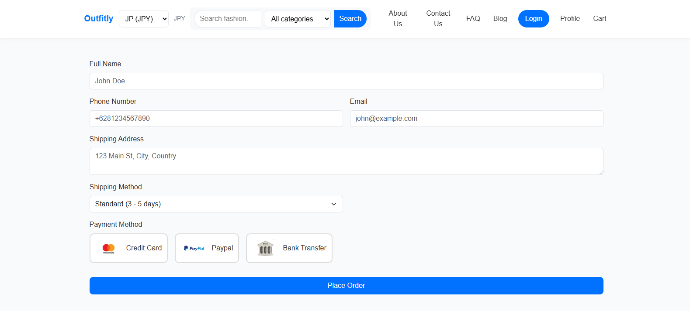

<div align="center">

  EN

</div>

<p align="center">
  
  
  
  
  
  
  
</p>

<div align="center">

# 👗 Outfitly

</div>

A modern React-based e-commerce platform for fashion and apparel.  Browse curated collections, manage your shopping cart, and enjoy a seamless shopping experience with a clean, responsive interface.

Live demo: **[Outfitly](https://outfitly-teal.vercel.app/)** 

---

## ✨ Features

- 🛍️ **Product Catalog** – Browse through fashion items with detailed product cards
- 🛒 **Shopping Cart** – Add, remove, and manage items in your cart with real-time updates
- 🔍 **Product Search & Filter** – Find your perfect outfit with advanced filtering options
- 💳 **Checkout Flow** – Streamlined checkout process with order summary
- 🔐 **User Authentication** – Login and registration pages with form validation
- 💝 **Wishlist & Like** – Save your favorite items with wishlist and like buttons
- ⭐ **Product Rating** – Rate products and provide feedback
- 📱 **Responsive Design** – Optimized for desktop, tablet, and mobile devices
- 💱 **Multi-Currency Support** – Shop in multiple currencies (IDR, USD, GBP, EUR, JPY, INR)
- 📦 **Order Management** – Track your orders and view order history
- 📝 **Blog Section** – Fashion tips, trends, and style guides
- 📞 **Contact & FAQ Pages** – Customer support and frequently asked questions
- 🧱 **Component-Based Architecture** – Reusable components for scalability and maintainability
- ⚡ **Fast Performance** – Optimized bundle size and lazy loading for quick page loads

---

## 🖼️ Screenshots

| | |
| : ---: | :---: |
| **Home Page** | **Product Catalog** |
|  | |
| **Product Details** | **Shopping Cart** |
|  | |
| **Checkout Page** |
|  |

---

## 🏗️ Project Structure

```bash
Outfitly/
├── public/                         # Static assets (index.html, favicon, images, etc.)
│   ├── assets/                     # Product images and other assets
│   ├── index.html                  # Main HTML file
│   ├── favicon.ico                 # Favicon
│   ├── site.webmanifest            # Web app manifest
│   └── robots.txt                  # SEO robots file
│
├── src/
│   ├── components/
│   │   ├── Buttons/                # Reusable button components
│   │   ├── Cards/                  # Card components
│   │   ├── CartItems/              # Shopping cart item components
│   │   ├── LikeButtons/            # Like button components
│   │   ├── PaymentMethods/         # Payment method selection
│   │   ├── ProductRates/           # Product rating components
│   │   ├── WishlistButtons/        # Wishlist button components
│   │   ├── styles/                 # Component-specific styles
│   │   ├── utils/                  # Utility functions (formatPrice, etc.)
│   │   ├── Header. jsx              # Navigation header with search
│   │   ├── Footer.jsx              # Site footer
│   │   ├── Login.jsx               # Login component
│   │   ├── Signup.jsx              # Sign up component
│   │   ├── User.jsx                # User profile component
│   │   ├── ChangePassword.jsx      # Change password component
│   │   ├── ProductCard.jsx         # Product card display
│   │   ├── ProductDetailPage.jsx   # Product detail view
│   │   └── SearchResultsPage.jsx   # Search results display
│   │
│   ├── pages/
│   │   ├── styles/                 # Page-specific styles
│   │   ├── HomePage.jsx            # Landing page
│   │   ├── AboutPage.jsx           # About us page
│   │   ├── ContactPage.jsx         # Contact page
│   │   ├── FAQPage.jsx             # FAQ page
│   │   ├── CartPage.jsx            # Shopping cart page
│   │   ├── CheckoutPage.jsx        # Checkout flow
│   │   ├── OrderPage.jsx           # Order history and tracking
│   │   ├── NotFoundPage.jsx        # 404 page
│   │   ├── Post1.jsx               # Blog post 1
│   │   └── Post2.jsx               # Blog post 2
│   │
│   ├── context/
│   │   └── CurrencyContext.js      # Currency context for multi-currency support
│   │
│   ├── data/
│   │   ├── products.js             # Product data
│   │   └── cart-products.js        # Cart data structure
│   │
│   ├── styles/                     # Global and theme styles
│   │   └── OutfitlyBase. css       # Global and theme styles
│   │
│   ├── App.css                     # Global app styles
│   ├── App.js                      # Root component with routing
│   ├── App.test.js                 # Tests for App component
│   ├── index.css                   # Global CSS / reset
│   ├── index.js                    # ReactDOM entry point
│   ├── theme.css                   # Theme variables
│   ├── logo.svg                    # Logo asset
│   ├── reportWebVitals.js          # Web vitals reporting
│   └── setupTests. js               # Jest / RTL test setup
│
├── docs/                           # Screenshots for README
├── .gitignore
├── LICENSE
├── package-lock.json
├── package. json
└── README.md
```

---

## 🧰 Tech Stack

- **Framework:** React 19 (`react@^19.2.3`, `react-dom@^19.2.3`)
- **Routing:** React Router v7 (`react-router-dom@^7.11.0`)
- **Styling:** CSS3 (Custom CSS modules and global styles) + Bootstrap
- **Icons:** React Icons (`react-icons@^5.5.0`) + FontAwesome (`@fortawesome/react-fontawesome@^3.1.1`, `@fortawesome/free-solid-svg-icons@^7.1.0`)
- **State Management:** React Context API (CurrencyContext)
- **Tooling:** Create React App (`react-scripts@5.0.1`)
- **Performance:** `web-vitals@^2.1.4` (performance reporting)

---

## 🚀 Getting Started

### 1️⃣ Clone the repository

```bash
git clone https://github.com/Kasanee-Teto/Outfitly.git
cd Outfitly
```

### 2️⃣ Install dependencies

Using **npm**: 

```bash
npm install
```

> This will install all dependencies including `react`, `react-scripts`, `react-router-dom`, `react-icons`, `@fortawesome/*`, and testing libraries as defined in `package.json`.

### 3️⃣ Start the development server

```bash
npm start
```

This runs the app in development mode at:    
`http://localhost:3000`

The page reloads automatically when you edit files, and lint errors appear in the console.

---

## ▶️ Available Scripts

From the project root, you can run:

```bash
# Start development server
npm start

# Build production bundle
npm run build

# Run tests in watch mode
npm test

# Eject configuration (not reversible)
npm run eject
```

- `npm start` – Starts the development server via `react-scripts start`.
- `npm run build` – Builds the app for production to the `build` folder with optimized bundle.  
- `npm test` – Launches the test runner in interactive watch mode.
- `npm run eject` – Exposes the underlying Webpack/Babel config (use with caution).

---

## 🌐 Deployment

The project is deployed on **Vercel**:

- **Live Site:** [Outfitly](https://outfitly-teal.vercel.app/)

To deploy your own version:

### Using **Vercel**:

1. Push your repository to GitHub.  
2. Log in to [Vercel](https://vercel.com/) and click **"New Project"**.
3. Import your GitHub repository.
4. Vercel will auto-detect Create React App and use `npm run build`.
5. Click **Deploy**.  
6. Every push to the main branch triggers a new deployment.

---

## 🛠️ Key Features Breakdown

### Multi-Currency Support
The app includes a currency conversion system that allows users to shop in different currencies:
- IDR (Indonesian Rupiah)
- USD (US Dollar)
- GBP (British Pound)
- EUR (Euro)
- JPY (Japanese Yen)
- INR (Indian Rupee)

#### Powered by **https://github.com/fawazahmed0/currency-api**

### Product Categories
Browse products across multiple fashion categories:
- Goth
- Cosplay
- Vintage
- Streetwear

### Interactive Components
- **Product Rating:** Rate products with an intuitive star rating system
- **Wishlist & Like:** Save favorite items for later
- **Search & Filter:** Advanced search with category filtering
- **Responsive Cart:** Real-time cart updates with order summary

---

## 🤝 Contributing

Contributions, ideas, and feedback are welcome! 

1. Fork the repository. 
2. Create a new branch:   
   ```bash
   git checkout -b feature/your-feature-name
   ```
3. Make your changes and commit:  
   ```bash
   git commit -m "Add some feature"
   ```
4. Push the branch:  
   ```bash
   git push origin feature/your-feature-name
   ```
5. Open a Pull Request to this repo.  

For larger features or refactors, consider opening an issue first to discuss the approach.

---

## 📜 License

This project is licensed under the **MIT License**.   
See the [`LICENSE`](./LICENSE) file for details.

---

## 💬 Contact

Have questions or suggestions? Feel free to reach out!  

- **GitHub:** [@Kasanee-Teto](https://github.com/Kasanee-Teto)
- **Repository:** [Outfitly](https://github.com/Kasanee-Teto/Outfitly)

---

<div align="center">

Made with ❤️ by [Kasanee-Teto](https://github.com/Kasanee-Teto) and [messtery](https://github.com/messtery)

</div>